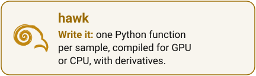
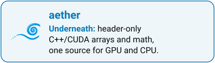
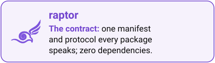

# amasat01.github.io

Source for the RAPTOR family landing site, published at
<https://amasat01.github.io/>. A GitHub user site: a single Sphinx page
(`index.md`) introducing the family — [aether](https://github.com/amasat01/aether),
[raptor](https://github.com/amasat01/raptor), [eagle](https://github.com/amasat01/eagle)
and [hawk](https://github.com/amasat01/hawk) — plus a short `about.md`.

<p align="center">
  <a href="https://amasat01.github.io/"><b>The RAPTOR family</b></a><br>
  <a href="https://amasat01.github.io/hawk/"><picture><source media="(prefers-color-scheme: dark)" srcset="_static/ecosystem/ecosystem_card_hawk_family_dark.svg"></picture></a>
  <a href="https://amasat01.github.io/eagle/"><picture><source media="(prefers-color-scheme: dark)" srcset="_static/ecosystem/ecosystem_card_eagle_family_dark.svg"></picture></a><br>
  <a href="https://amasat01.github.io/aether/"><picture><source media="(prefers-color-scheme: dark)" srcset="_static/ecosystem/ecosystem_card_aether_family_dark.svg"></picture></a>
  <a href="https://amasat01.github.io/raptor/"><picture><source media="(prefers-color-scheme: dark)" srcset="_static/ecosystem/ecosystem_card_raptor_family_dark.svg"></picture></a>
</p>

## Build

```bash
pip install -r requirements.txt
make html       # build into _build/html
make strict     # same, with warnings promoted to errors
make linkcheck  # verify every external link
```

`.github/workflows/pages.yml` runs `make strict` and deploys `_build/html`
to GitHub Pages on every push to `main`.

## License

Licensed under the Apache License, Version 2.0: free for any use,
commercial or not, with attribution. See `LICENSE` for the full text.

Copyright 2026 Alessandro Masat.
